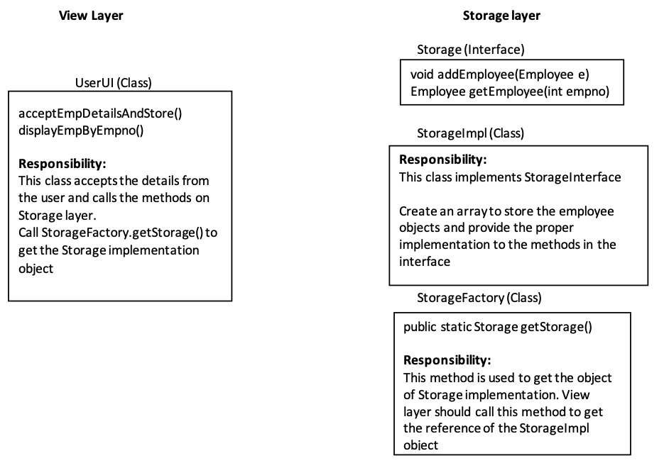

# :keyboard: LAB 4

---

### :rocket: Objectives

- Override methods in derived classes
- Demonstrate runtime polymorphism
- Typecasting and method access
- Interfaces and inheritance
- Layered application design

---

### :gear: Tasks

#### 1. :bulb: Override Methods

Override `showDetails()` method in the `SpecialMovie` and `InternationalMovie` (created in previous assignment) to display the details of additional fields.

---

#### 2. :dart: Array of Movies

Create an array of `Movie` class and store objects of `Movie`, `SpecialMovie`, and `InternationalMovie` classes in the array.

---

#### 3. :test_tube: Polymorphism in Action

Using a single `for` loop, traverse the above array and call the method `showDetails()` on all the objects of the array. Correlate this with your knowledge of runtime polymorphism.

---

#### 4. :warning: Typecasting for Access

Check whether it is possible to call the methods of `SpecialMovie` and `InternationalMovie` while traversing the array inside the for loop. If not, use typecasting to do this.

---

#### 5. :brain: Interfaces & Inheritance Example

Come up with your own example to demonstrate the following concepts:

- Creation of Interfaces
- Creation of interfaces by extending other interfaces
- Creation of class by extending another class and implementing multiple interfaces
- Creation of reference variable of an interface
- Creation of a class that implements above interface
- Store an object of class created in step e in the reference variable of the interface created in step d
- Call the methods of the object using interface reference variable

---

#### 6. :triangular_ruler: Layered Employee Management Application

A Java application with multiple layers is responsible for managing details of Employees.

- The view layer is responsible for user interaction and only accepts or displays details from/to user.
- View layer will communicate with storage layer for all CRUD operations.

Develop the application based on the below class structure. Class structures, method information and responsibilities of each class are given below. Create a main class to test your application.

- The entity class `Employee` contains `emp no`, `first name`, `last name`, `city` & `salary` attributes.

---

#### :shield: Layered Architecture Diagram

